# TJBot zeroチュートリアル 基礎編

<!-- TOC -->

- [TJBot zeroチュートリアル 基礎編](#tjbot-zeroチュートリアル-基礎編)
    - [TJBot zeroとは](#tjbot-zeroとは)
        - [どこで手に入るの？](#どこで手に入るの)
    - [TJBot zeroの基本機能](#tjbot-zeroの基本機能)
        - [ハンズオンイメージ版 TJBot zeroでできること](#ハンズオンイメージ版-tjbot-zeroでできること)
        - [ハンズオンで使用するAPI](#ハンズオンで使用するapi)
    - [動作確認](#動作確認)
    - [TJBot zeroをWiFiへ接続する](#tjbot-zeroをwifiへ接続する)
    - [WiFiの設定](#wifiの設定)
        - [WiFiの仕様](#wifiの仕様)
        - [プライバシーセパレーターに注意!](#プライバシーセパレーターに注意)
        - [WiFi設定手順](#wifi設定手順)
        - [IPアドレスを確認しよう](#ipアドレスを確認しよう)
        - [プッシュボタンが無い場合での確認方法](#プッシュボタンが無い場合での確認方法)
        - [Node-REDフローエディタへ接続しよう](#node-redフローエディタへ接続しよう)
        - [SSHで接続しよう](#sshで接続しよう)
        - [VNCで接続しよう](#vncで接続しよう)
    - [IBM Cloudのサービスを有効にしよう](#ibm-cloudのサービスを有効にしよう)
        - [クラウドアカウント登録 <br>](#クラウドアカウント登録-br)
        - [初めてのIBMクラウド <br>](#初めてのibmクラウド-br)
        - [ライトアカウントの登録 <br>](#ライトアカウントの登録-br)
        - [IBM Cloud AI サービスを立ち上げる <br>](#ibm-cloud-ai-サービスを立ち上げる-br)
        - [Node-REDとの連携 <br>](#node-redとの連携-br)
    - [Node-REDの基本](#node-redの基本)
        - [フローエディタを開こう](#フローエディタを開こう)
        - [sampleフローを停止しよう](#sampleフローを停止しよう)
    - [頭のLEDを好きな色に光らせてみよう](#頭のledを好きな色に光らせてみよう)
    - [腕を振ってみよう](#腕を振ってみよう)
        - [Node-REDのフローを改良してループさせよう](#node-redのフローを改良してループさせよう)
    - [翻訳してみよう](#翻訳してみよう)
        - [Google翻訳を使用してみる](#google翻訳を使用してみる)
            - [翻訳内容はどこで変えるの？](#翻訳内容はどこで変えるの)
        - [Watson Language Translatorを使用してみる](#watson-language-translatorを使用してみる)
        - [様々な言語に翻訳していろいろな言葉を話そう](#様々な言語に翻訳していろいろな言葉を話そう)
    - [TJBot zeroで発声してみよう](#tjbot-zeroで発声してみよう)
    - [画像認識をしてみよう](#画像認識をしてみよう)
        - [ダッシュボードを使用して撮影する](#ダッシュボードを使用して撮影する)
        - [IBM Maxを使用して画像認識を行う](#ibm-maxを使用して画像認識を行う)
        - [IBM Watson Visual Recognitionを使用して画像認識を行う](#ibm-watson-visual-recognitionを使用して画像認識を行う)
    - [シャットダウンしよう](#シャットダウンしよう)
        - [TJBot zeroのスイッチで停止する](#tjbot-zeroのスイッチで停止する)
        - [sshで停止する](#sshで停止する)
    - [さいごに](#さいごに)

<!-- /TOC -->

## TJBot zeroとは

TJBot zeroは、インターネットを経由してIBM Cloudへ接続しNode-REDとIBM Watsonの機能を利用するAI / IoT学習をするためのハンズオンキットです。

TJBot zeroは日本のIBM Cloud User Group(BMXUG)とIBM Champion、IBM社員有志でつくられたボール紙ベースのキットです。

TJBotをベースとして、サイズを小さくより運びやすくしています。
Raspberry pi zero WHをベースにNode-REDで構成されています。

[TJBot](https://www.research.ibm.com/tjbot/)はIBM US ResearchによってWatsonを学習するために開発したレーザカットダンボールで作るAIキットです。
TJBotはRaspberry Pi 2B/3B/4BをベースにNode.js / Python / Node-REDで構成されています。
[オープンソースで3Dプリントデータや、レーザーカットデータが公開](https://ibmtjbot.github.io/)されています。

### どこで手に入るの？

- 型紙データ
TJBot zeroのレーザーカットデータは日本IBM社のページで公開されています。<br>
[ibm.biz/tjbotjp](https://ibm.biz/tjbotjp)

- ハンズオンSDカードイメージ
このチュートリアルはTJBot zeroを育てる有志TJBot fanグループが制作した
[TJBot Zero raspbianのSDカードイメージ](https://github.com/tjbotfan/tjbotzero-raspbian/releases)を使用します。

- ハンズオン開催はしているの？
[TJBot Fanサイト](https://tjbotfan.tokyo/)で定期開催の案内をしています。<br>
`2020/09現在: コロナウィルス対策・時勢を鑑み、密となりやすいハンズオンは現在中止しています`

- パーツキット
[TJBot Fanコミュニティショップ](https://shop.tjbotfan.tokyo/)で購入が可能です。

## TJBot zeroの基本機能

TJBot zeroはLED、カメラ、マイク、スピーカー、サーボモーターで動く腕が構成されています。
Node-REDを使用することでコードをあまり書かずに動作させることができます。

### ハンズオンイメージ版 TJBot zeroでできること

- TJBot zeroが光る
    - RGB フルカラーLED搭載
    - 起動すると7通りの色を順番に点灯します
- TJBot zeroがしゃべる
    - 内蔵のopenjtalkを利用して「こんにちは、僕の名前は TJBot です」としゃべります。
    - 2019/04以降のモデルではボタンスイッチを短く押すとWiFiから取得したIPアドレスを「IPアドレスはxxx.xxx.xxx.xxxです。」と発声します。
- TJBot zeroが見る
    - 内蔵カメラでOpenCVによる顔判定
        - personと判別されるとサーボモーターを動かして腕を振ります。
    - Watson Visual Recognitionを利用した画像認識
        - 画像認識結果をNode-REDフローエディタから確認できます。

### ハンズオンで使用するAPI
- IBM cloud
    - 画像認識：Watson Visual Recognition
    - 音声合成：Watson Text to Speech
    - 音声認識：Watson Speech to Text
    - 翻訳：Watson Translator
- IBM MAX
    - Image caption generator
- IBM 以外のクラウドも組合せて使うことができます
    - Google translator
    - Azure Cognitive Service

## 動作確認

1. TJBot zero 配線チェック
ハンズオンで組み立てた／貸し出しのTJBot zeroがスピーカーのケーブル、ブレットボード音源モデルはブレットボード接続ケーブルが外れていないか確認を行ってください。

2. TJBot zero 電源ケーブルの接続
TJBot zeroから出ているUSBケーブルをUSB電源アダプタまたはPCへ接続しましょう。このUSBポートは電源供給のみで使用します。
`電源が入らないときは: 電圧が不足していないか確認しましょう`
TJBot zeroの正面向かって左側のケーブル用スリットからRaspberry pi zero WHのステータスLEDが見えます。このLEDが点滅し始めると起動処理が始まったことをしめします。

3. 起動の確認
2-3分経過するとスピーカーから「こんにちは、僕の名前は TJBot です」と発声します。

4. 頭のLEDが7パターンの色で点滅する
頭のLEDが自動的に点灯します。

5. 腕を振る
TJBot zeroの右目（正面向かって左）はカメラが内蔵されています。
内部のOpenCV(画像認識ツール)が人と判別するとサーボモーターを動かして腕を振ります

6. シャットダウン
TJBot zeroの正面向かって左、後ろ側にスイッチがあります。(2019/04モデルから)
このボタンを長押しするとシャットダウンが始まります

これで基本的な動作確認が完了です。
うまく動かない場合は一度配線のチェックなどをしてみましょう。

## TJBot zeroをWiFiへ接続する

## WiFiの設定

SDカードイメージではTJBotFanで行っているハンズオンでは標準のSSID/PWが提供されていますが、ご自宅のWiFi環境やテザリングを利用している場合は変更をした上使用する必要があります。

TJBot zeroでは、raspbianのWiFi設定手順に従って`wpa_supplicant.conf`ファイルの編集または、GUIデスクトップからの設定でWiFi設定を行うことができます。

### WiFiの仕様

TJBot zeroで使用しているRaspberry pi zero WHでは、2.4GHzのWiFiを使用しています。
本手順はWPA形式での設定方法を紹介しています。

### プライバシーセパレーターに注意!

WiFiルーターの多くはデフォルトで`プライバシーセパレーター`がオンとなっている環境が多くあります。
セキュリティを目的として公共のWiFiスポットではほとんどの環境でオンとなっているもので、
WiFi端末同士の通信のみNGとして不正アクセスを防ぐ手段として提供されています。

TJBot zeroではWiFiに接続した状態のraspberry pi上で稼働しているNode-REDフローエディタやSSH・VNCなどを使用して
設定の変更や動作を行うため、WiFi端末同士もしくはPCのLANポートからWiFi端末側へのアクセスが可能な状況を作る必要があります。

プライバシーセパレーターのオフの方法はお手持ちのルーターの取扱説明書をご確認ください。

### WiFi設定手順

TJBotFanではWiFi設定手順を以下のサイトで紹介しています。
https://tjbotfan.tokyo/wifi/

現在は外部サイトで提供されている設定ツールを使用して設定する方法でご紹介します。
実際に設定される際は上記URLをブラウザから開いて使用してください。

1. 設定ツールをhttps://tjbotfan.tokyo/wifi/から辿って開きます。
2. SSID、Passphraseを入力します。<br>
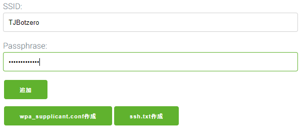
3. 追加ボタンをクリックします。<br>
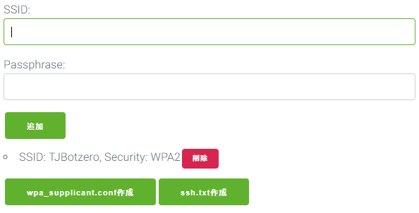
4. `wpa_supplicant.conf作成`ボタンをクリックして、ダウンロードします。
5. ダウンロードしたファイルをSDカードにコピーします。
コピー先は`boot`というラベルのついたディスクです。<br>
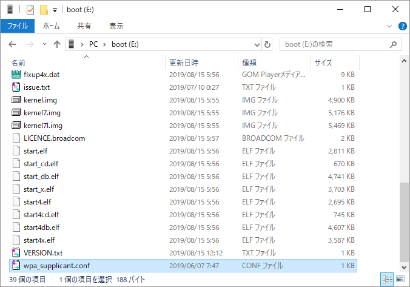


### IPアドレスを確認しよう

SDカードイメージではプッシュボタンスイッチを押すことでIPアドレスを教えてくれる機能を標準搭載しています。
`注意：sampleタブを無効にすると動かなくなります`
プッシュボタンを短く押すと、WiFi接続中はサウンド再生後「IPアドレスは、xxx.xxx.xxx.xxxです」と数字を読み上げてくれます。
<br>


### プッシュボタンが無い場合での確認方法

多くのWiFiルーターでは管理画面からIPアドレスの配布状況を知ることができます。

NTTの光ルーターの多くは、`トップページ ＞ 情報 ＞ DHCPv4サーバ払い出し状況`から表示が可能です。
他環境の場合はそれぞれのルーター機器のマニュアルや画面から探してみてください。

ホスト名に`raspberrypi`と表示されているIPアドレスがお手元のTJBotzeroのIPアドレスになります。

※複数TJBotzeroやraspberrypiを同時接続すると混乱を招くのでまずは１台ずつ試してみましょう。

### Node-REDフローエディタへ接続しよう

IPアドレスが確認できたところでTJBotが動作しているNode-REDのフローエディタへ接続しましょう。
お手持ちのブラウザから(google chrome推奨) `http://{TJBotのIPアドレス}:1880`とアドレス欄に入力して接続してください。

たとえば、TJBotのIPアドレスが`192.168.10.17`の場合、`http://192.168.10.17:1880`のようになります。

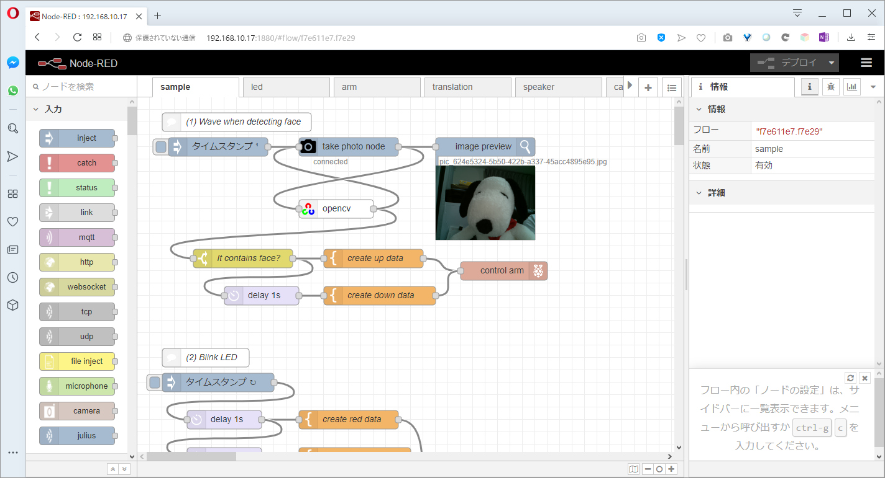

### SSHで接続しよう

SDカードイメージではSSHサーバーが標準でオンとなっており、Raspberry piで動作するOSへ接続することができます。
お手持ちのSShクライアントソフトウェアを利用いただき接続することが可能です。

raspbianのデフォルトID・パスワードを使用しているため、接続情報は以下のとおりです。

| ID | パスワード |
|:---|:-----------|
| pi | raspberry  |

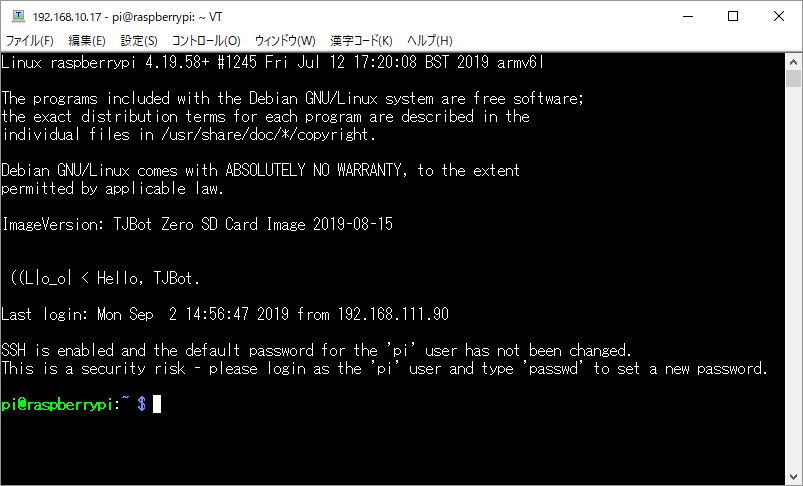

接続するとイメージのバージョン番号と、Hello, TJBotと表示されます。
これで現在動いているバージョンが確認できるようになっています。

### VNCで接続しよう

SDカードイメージではVNCサーバーが標準でオンとなっており、Raspberry piデスクトップを使用することができます。


1. Google ChromeプラグインのVNC Viewer for Google Chromeを利用します。<br>
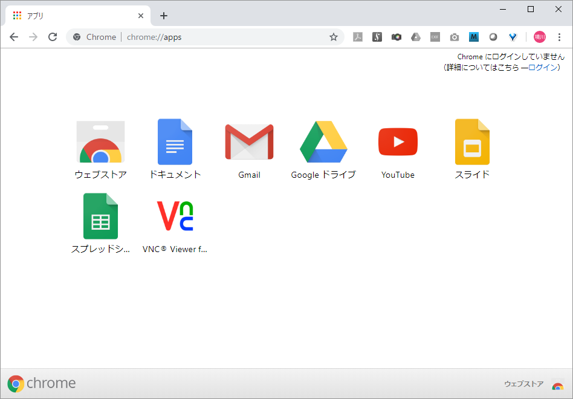


2. Address欄にIPアドレスを入力し、`Connect`をクリックします。<br>


3. 初回接続時のみ、接続先の確認が表示されます。<br>
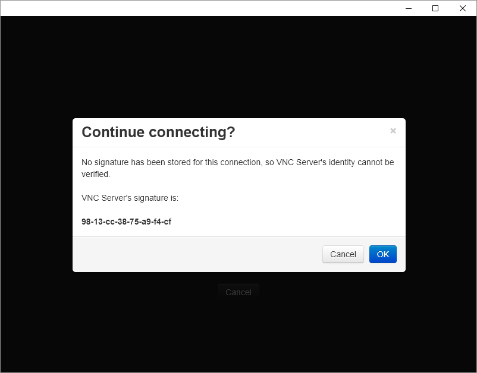

4. ログイン情報を入力します。

| ID | パスワード |
|:---|:-----------|
| pi | raspberry  |

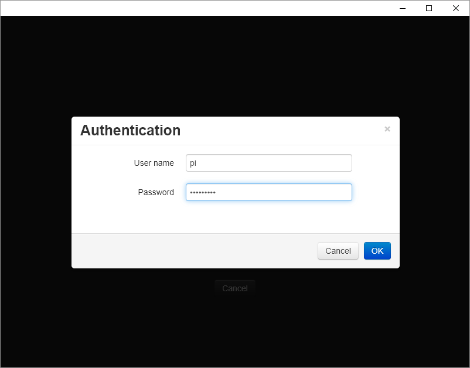

5. 初回ログイン時にダイアログが表示されますが、一つ目は"Warning"と表示されますが、ログインパスワードを変更するように促すメッセージです。OKを押して次へ進みます。

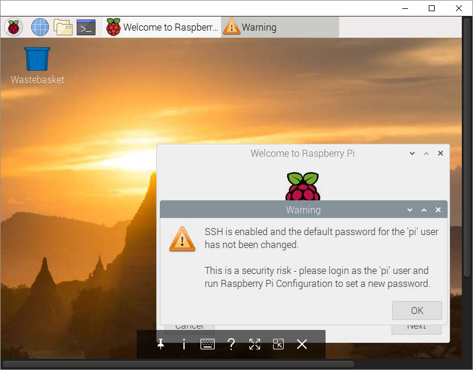

6. 2つ目と、初期セットアップダイアログです。初期ダイアログはスキップしても大丈夫です。<br>


7. デスクトップが表示されました。
ブラウザをこの画面から使用することができますが、
非常に動作が重たくなりフローエディタを使用するには環境として厳しいです。

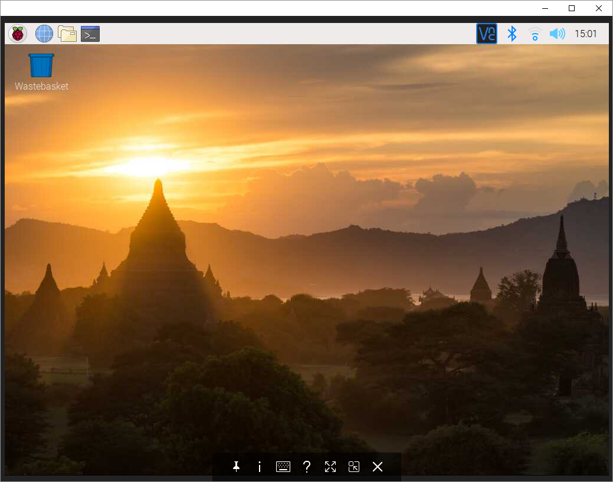


## IBM Cloudのサービスを有効にしよう

### クラウドアカウント登録 <br>
この章は、TJBot zero基礎編で使用する、クラウド連携を行うための説明です。<br>
IBM Cloudアカウント登録やサービスの立ち上げについて解説します。

*  初めてのIBM Cloud（アカウントの種類）
*  ライトアカウントの登録
*  IBM Cloud AI サービスを立ち上げる
*  Node-REDとクラウドの連携

### 初めてのIBMクラウド <br>
IBM Cloudは現在３つのアカウント種類があります。
TJBot zero基礎編で紹介する機能は、全てライトアカウントで試せます。(2019年9月現在)

**ライトアカウント** <br>
    e-Mailと氏名、国名、パスワードの登録で無期限に使用できます。<br>
    クレジットカード登録不要で、請求が来ることはありません。<br>
    利用可能なサービスの種類、割り当てられるメモリー容量やひと月あたりの利用に上限があります。<br>

**従量課金アカウント** （PAYG：Pay As You Go / 読み方：ぺいあずゆーごー・略称：ぺいじー）<br>
    利用者情報とクレジットカードを登録することにより、全てのサービスが使用できます。<br>
    さまざまなサービスに、ライトアカウントより豊富な無料利用枠が設定されています。<br>

**サブスクリプションアカウント**<br>
    定額契約サービスでで割引制度があります。<br>
    研究や業務利用で利用する方に推奨するアカウントです。<br>
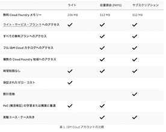

### ライトアカウントの登録 <br>
**Step1: E-mailの登録チェック** <br>
IBM Cloudで検索 またはQRコードよりアカウント登録画面を開きます。<br>
 

E-mailを入力後に、入力欄右の[→]で登録チェックを行います。<br>
E-mailのチェックが終わると、入力フィールドが表示されます。名、姓、国、パスワードを入力してください。<br>
E-mail アドレス登録済みの場合は右上の[ログイン]よりご利用ください。<br>
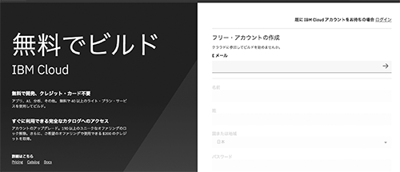

**Step2: 登録メールの確認** <br>
タイトルが”Action required: Confirm your IBM Cloud account”のメールを開きます。<br>
画面中央の[Confirm account] ボタンをクリックすると、IBM Cloudのログイン画面が開きます。<br>
登録したパスワードを入力し、IBM Cloudにログインしてください。<br>
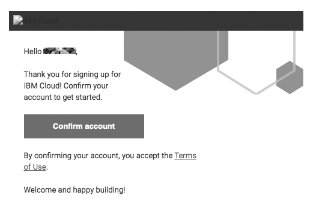
<br>

### IBM Cloud AI サービスを立ち上げる <br>
**TJBot zero基礎編で紹介するサービスは2種類です。**<br>

*  Language Translator  (読み方：らんげーじとらんすれーたー)<br>
  複数の言語に対応したニューラル機械翻訳です。 <br>
  コンテンツを複数言語に短時間で翻訳します。（日本語からの翻訳は英語を介して使用） <br> 
  文書、アプリ、ウェブサイトなどの翻訳から、多言語のチャットボットの作成まで幅広く対応しています。<br>
  コーパスをカスタマイズすることにより、業界や地域特有の用語に対応した独自の翻訳モデルを作成できます。<br> 

*  Visual Recognition  (読み方：びじゅあるりこぐにっしょん) <br>
  場面、対象物、顔のイメージ、その他のコンテンツを分析し画像コンテンツに含まれる意味を検出します。<br>
  既製のデフォルト・モデルを選択するか、独自のカスタム種別を作成します。<br>


**Step1:サービスメニューを開く**<br>
画面トップメニューの[カタログ]をクリックし、左サイドメニューの[AI]を選択します。 <br>
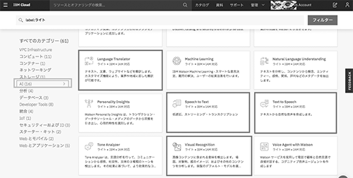


**Step2:サービスの立ち上げ**<br>
立ち上げるサービスをクリックします。 <br>
サービス名、デプロイロケーション、リソースグループ、タグ（初期値でOK）、価格プランを確認し、[作成]ボタンをクリックします。<br>

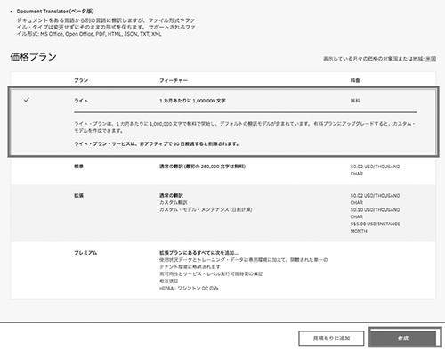
<br><br>
**Step3:立ち上げたサービスの確認**<br>
画面トップメニュー左橋の[三]ナビゲーションメニューよりリソース・リストを開きます。<br>
Servicesに作成したサービス名があり、状況が”プロビジョン済み”になっていることを確認します。 <br>
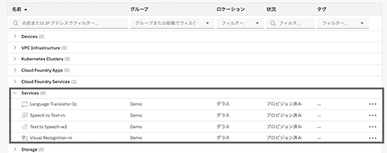

<br><br>
**TJBotと親和性の高い、人気のサービス紹介** <br> 
いずれもカタログの[AI]より作成できます。 <br>
各サービスにチュートリアルがあり、各言語からの呼び出しサンプルコードなどを掲載しています。

*  Test to Speech （読み方：てきすととぅすぴーち）<br>
  テキストと自然言語を処理し、適切な抑揚をつけて合成した音声出力を生成します。 <br>
  マイクと連動させます。<br>

*  Speech to Text （読み方：すぴーちとぅてきすと）<br>
  音声をテキストに書き起こすことで、さまざまな用途に音声書き起こし機能を使用できるようにします<br>
  スピーカーと連動させます。<br>
  
*  Watson Assistant（読み方：わとそんあしすたんと）<br>
  会話型インターフェースを任意のアプリケーション、デバイス、チャネルに組み込めるようになります。<br>
  チャットボットなどに活用できます。<br>

**ライトアカウント利用に新規作成ができないとき** 
<br>
ライトアカウントは、割り当てメモリー制限により複数のサービスを同時に立ち上げられないケースがあります。<br>
Visual Recognition やLanguage Translatorは同時に複数（Visual Recognitionを２つなど）は利用できません。<br>
不要になったサービスは削除してご利用ください。<br><br>
また、ひと月あたりの呼び出し回数に上限があるものはアカウント単位で管理されています。<br>
上限値を超えて利用する場合は、クレジットカード登録のPAYGアカウントにアップグレードしてください。<br>

### Node-REDとの連携 <br>
Node-REDで作成したノードにIBM CloudのAIサービスを連携する方法です。 <br>
**Step1: APIキーの取得** <br>
IBM Cloudで対象サービスをクリックして開きます。<br>
右メニューの管理を開き、[API鍵]をコピーします。（右のアイコンがコピー機能）<br>

**Step2: ノードに設定** <br>
Node-RED画面で対象のノードをクリックします。 <br>
API Key欄にコピーしたAPI鍵をペーストします。 <br>
[完了]で画面をとじ、[デプロイ]します。 <br>

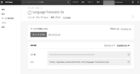
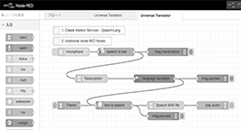
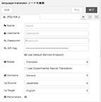

## Node-REDの基本

### フローエディタを開こう

[Node-REDフローエディタへ接続しよう](#node-redフローエディタへ接続しよう) で紹介した方法でフローエディタを開きましょう
TJBot zeroを操作するときは必ずこの手順が必要です。

### sampleフローを停止しよう

いよいよTJBot zeroをご自身の手で動かすところまで来ました。

ここではブラウザに表示されているフロー（手順）を修正するRaspberry pi zeroへ反映する「デプロイ」を行います。

画面左上部の「sample」タブをダブルクリックして、タブのプロパティを表示します。
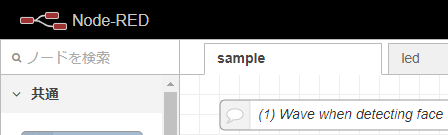  

タブの状態が「`有効`」となっているところをクリックし、「`無効`」に変更します。
変更後、「完了」をクリックし元の画面に戻ります。
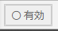  

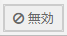  


画面右上に今まで灰色になっていた「デプロイ」ボタンが、赤色に変わっているはずです。ここで「デプロイ」ボタンをクリックしてRaspberry pi zeroへフローを反映します。

Node-REDではブラウザ上で自由にフローを編集することができますが、
変更後「デプロイ」ボタンをクリックすることで反映となります。
ここで忘れずに覚えておきましょう。


  

頭のLEDが順番に色を変えて点灯していたものが、停止するはずです。
これでsampleフローの無効化が可能完了しました。

## 頭のLEDを好きな色に光らせてみよう
さっそくTJBot zeroの頭のLEDを好きな色に点灯させてみましょう。
「led」タブをクリックして開いてください。

Node-REDのinjectノードという青色のノード（フローの処理を開始するためのイベントノード）をおいてありますので、実行したいノードの左側のボタンをクリックすることで処理を実行することができます。

injectノードの先にはLEDの制御を行うパラメータをtemplateノード(JSONデータを記載)にLEDのRGB値が入っています。これをLEDを点灯するためのcontrol ledサブフローが入ったノードに送ることでLEDを点灯させる仕組みになっています。

好きな色のinjectノードをクリックして、手元のTJBot zeroの頭が光るかを確認してみてください。

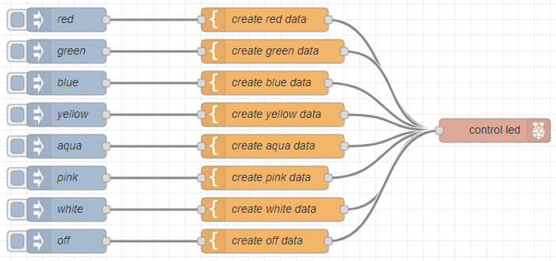  


## 腕を振ってみよう

次に腕を動かしてみたいと思います。
「arm」タブをクリックして開いてください。

ここでは３つのinjectノードがおいてあります。
| injectノード | 動作           |
|:-------------|:---------------|
| up           | 腕を上げる     |
| middle       | 腕を水平に保つ |
| down         | 腕を下げる     |

TJBot zeroの腕はギアを指す位置で思った方向に腕が動かず、後ろに腕が向くこともあるかもしれません。

一度腕を下げるを３回実行した後に、腕に向いた状態で取り付けてください。
「up」injectノードをクリックすると、ちゃんと腕が上がるようになるはずです。

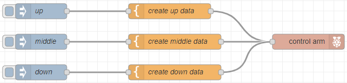  


### Node-REDのフローを改良してループさせよう

Node-REDのフロー型プログラミングを体験してみましょう。

ここでは「一つのボタンをクリックして開始すると、腕を上げて、一定期間待って腕を下げる一覧の流れを行うフローを追加してみます。

ここでは新しく「inject」ノードとイベントの実行を遅延させる「delay」ノードを使用します。

以下の画像を参考にフローエディタの左側パレットから「inject」と「delay」を探してドラッグ＆ドロップして配置しましょう。

  


次に配置された「inject」ノードの右側を見てください。小さな四角いボタンのようなものがありますね。これはワイヤーをつなぐ為の終端です。すでに動いているフローを見るとわかるとおり、injectノードからtemplateノードにワイヤーがつながっています。

injectノードからcreate up dataノードの左端にワイヤーをつなぎます。
次にinjectノードからdelayノードの左端にワイヤーをつなぎます。

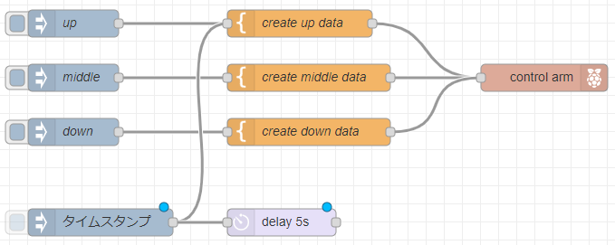  


これでinjectノードで開始すると２個のノードに同時に命令が実行されます。
delayノードの右端からcreate down dataノードへワイヤーをつなぎます。
delayノードをダブルクリックし、プロパティ画面で遅延時間を500ミリ秒に変更します。

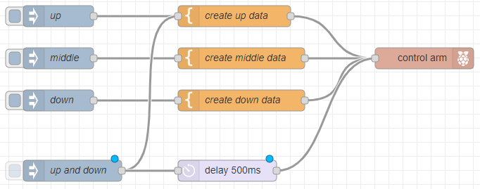  


最後に忘れずに「デプロイ」ボタンをクリックしてRaspberry piへ反映させましょう！

injectノードを他のノードのように修正したい場合はダブルクリックしてプロパティ画面から名前を変えることができるので、ぜひこちらもチャレンジしてみてください。

## 翻訳してみよう

次はTJBot zeroで翻訳をさせてみましょう。
「translate」タブをクリックして開いてください。

このチュートリアルではGoogle翻訳とWatson Language Translatorを使用します。
Watson Language TranslatorではAPI Keyが必要になるため、IBM Cloud側でWatson Language Translatorのサービスデプロイをまだ行っていない場合は、[IBM Cloudのサービスを有効にしよう](#ibm-cloudのサービスを有効にしよう)を参考にサービスのデプロイと、API Keyのコピーをとっておいてください。

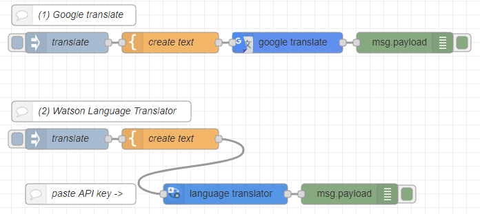  


翻訳部分はNode-REDの画面上でのみ結果が表示されます。

結果を表示する為には、画面右側の虫マーク（デバック）をクリックして処理結果が表示できようにしましょう。

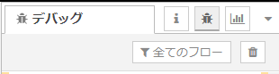  

### Google翻訳を使用してみる
それでは、まずGoogle翻訳を使用して翻訳をしてみましょう。
「(1)Google Translate」の下にある「translate」injectノードの左端ボタンをクリックして実行しましょう。

Node-REDフローエディタの右側デバックの箇所に新しく以下のような表示ができたら翻訳ができていることになります。

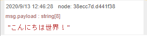  

#### 翻訳内容はどこで変えるの？

翻訳する文字列を変えてみましょう。オレンジ色の「create text」ノードをダブルクリックすると、初期データとしてテンプレート項目に「Hello Wordl!」が入力されています。
この内容を変更し、「完了」をクリック、忘れずに「デプロイ」してみましょう。

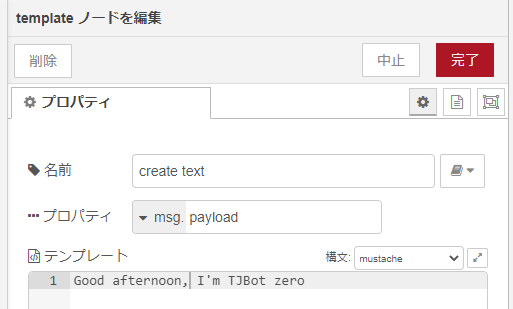  


先程と同様に「translate」injectノードの左端ボタンをクリックして実行しましょう。

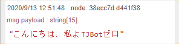  

### Watson Language Translatorを使用してみる

次にWatson Language Translatorを使用してみましょう。
こちらではAPI Keyの登録が必要なため事前にAPI Keyのコピーが必要です。

画面上の「language translator」ノードをダブルクリックしてプロパティ画面を表示します。

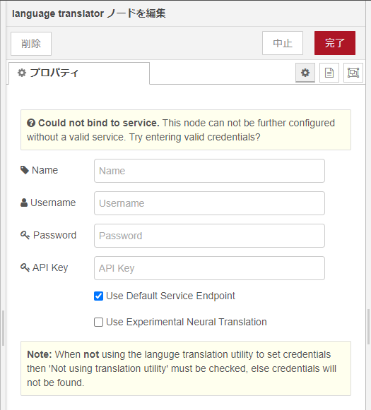  

ここではAPI Keyのみをペーストします。
language translatorを「Tokyo」でサービスをプロビジョニングした場合は「Use Default Service Endpoint」のチェックを外して、URLの欄にIBM Cloud側でAPI Keyを取得したページと同じ場所にあるURLをコピーして「Service Endpoint」の項目にURLをペーストしてください。

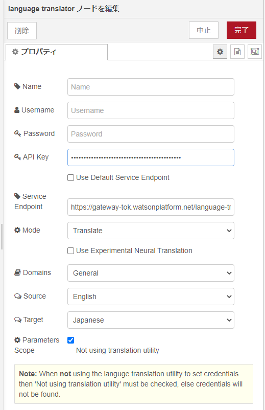  

API Keyの欄に入力が終わると設定項目が上記画像のように増えます。

「完了」をクリックし、忘れずに「デプロイ」をクリックして、「(2)Watson Language Translator」の下にあるフローの「translate」injectノードをクリックしてGoogle翻訳と同じように翻訳してみましょう。

  

同じように翻訳することができました。

「(2)Watson Language Translator」の下にあるフローの「create text」を変えて翻訳する文書を変えてみましょう。

### 様々な言語に翻訳していろいろな言葉を話そう
Watson Language Translatorサービスはさまざまな言語への翻訳が可能です。
日本語から翻訳する先の言語は数が少なく見えますが、英語からはさまざまな言語への翻訳を行うことが標準でできるようになります。

「language translator」ノードをダブルクリックしてプロパティ画面を表示します。
「Source」が翻訳元の言語、「Target」が翻訳先の言語になります。

SourceをEnglish、TargetをFrenchにしてフランス語でHello worldを表示してみましょう！

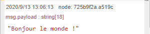  

## TJBot zeroで発声してみよう

次はTJBot zeroで発声を行います。
「speaker」タブをクリックして開いてください。

ここではOpenJtalkというOSSのプログラムを使用して音声合成を行います。

「greeting」injectノードをクリックしてまずは設定されているテキストを発生させてみましょう

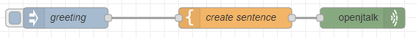  

「create sentence」templateノードに文字列が記入されているので、
この中身を変更してデプロイ、好きな文字を発声させてみましょう。

音声合成プログラムOpenJtalkの仕様で英字は1文字ずつアルファベット読みとなるため、カタカナで入力しましょう。

## 画像認識をしてみよう

次はTJBot zeroで画像認識を行います。
「camera」タブをクリックしてください。

ここではIBM MaxというOSSの画像認識とIBM Watson Visual Recognitionを使用して画像認識を実施します。

### ダッシュボードを使用して撮影する

Node-REDではフローエディタを使用して開発を行うことができますが、
利用する人にこの画面を公開すると動作を書き換えられてしまいます。
Node-REDのユーザーインターフェイス用のdashboardという機能のなかから、写真撮影ブースを以下のフローで用意したので試しに撮影してみましょう。

Node-REDフローエディタを開いているウィンドウとは別にブラウザを開きましょう。多くのブラウザは「Ctl」（macはcommand)キー＋「N」で新しいウィンドウが開きます。

URLは `http://{TJBotのIPアドレス}:1880/ui/`とアドレス欄に入力して接続してください。

たとえば、TJBotのIPアドレスが`192.168.10.17`の場合、`http://192.168.10.17:1880/ui/`のようになります。

「BUTTON」をクリックすることでカメラで撮影されます。
今回はスマートフォンを撮影してみました。

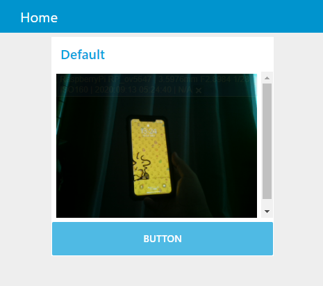  

こちらを改良することでフローエディタを使わずに画像認識結果を表示したりユーザーと対話する画面を作ることができます。是非チャレンジしてみてください。

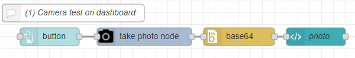  

### IBM Maxを使用して画像認識を行う

さまざまな画像認識ライブラリが公開されていますが、
IBMがAI機能のエンジンをOSSで公開しているプロジェクトがあります。
IBM Maxというプロジェクトでこのサンプルは画像認識を行うエンジンを利用して認識させるものになります。

デバッグウィンドウに結果が表示されるので撮影したいものをTJBot zeroのカメラに合わせて「generate caption」injectノードをクリックして画像認識を試してみましょう。

`※サンプルプログラムの都合で現在ご利用いただけません`


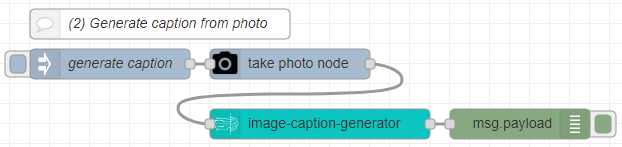  


### IBM Watson Visual Recognitionを使用して画像認識を行う

最後にWatson Visual Recognitionを使用して画像認識を行ってみましょう。
このフローでは、Watson Visual Recognitionから回答を得た情報から、確立の高いものを抽出してデバッグに結果を表示します。

API Keyが必要になるため、[IBM Cloudのサービスを有効にしよう](#ibm-cloudのサービスを有効にしよう)を参考にWatson Visual RecognitionのプロビジョニングとAPI Keyの取得を行ってください。

`ご案内：Watson Visual RecognitionはIBM cloudによるライトプラン廃止により有料となりました。2020/10/16以降は無料でお試しいただくことが出来ないため、こちらの利用を計画されている方はご自身でWatson Visual Recognitionのオーダーを行ってください。`


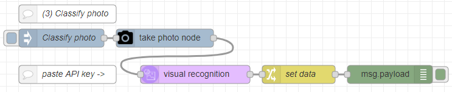  

「visual recognition」ノードをダブルクリックしてプロパティ画面を表示します。

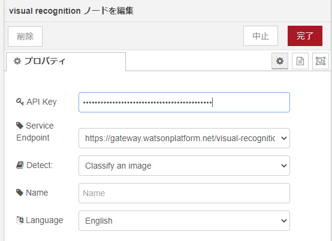  

「API Key」の入力欄にAPI Keyを貼り付けし、「完了」ボタンをクリック、忘れずに「デプロイ」ボタンをクリックして、
TJBot zeroの前に認識させたいものを向けてから「Classify photo」injectノードをクリックして実行してみましょう。
デバックの項目に認識結果が表示されます。

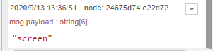  

スマートフォンを撮影したところ、"screen"（画面）と認識することができました。

手近にある様々なものを画像認識してみましょう！

`チャレンジ:` 画像認識した結果を今までのフローを組みあせて結果の日本語化、発声させてみましょう

`ヒント:` すべてのフローはマウスで選択し、コピー＆ペーストできます。タブを切り替えてコピー、組み合わせたいところでペースト、
フローをつなげてみてみください。

## シャットダウンしよう

### TJBot zeroのスイッチで停止する
sampleフローにはTJBot zeroをシャットダウンするためのフローが登録されています。
[sampleフローを停止しよう](#sampleフローを停止しよう)でsampleフローの動作を停止した為、チュートリアルをここまで進めた方はスイッチを押しても反応がないはずです。
[sampleフローを停止しよう](#sampleフローを停止しよう)の手順の逆を行い、無効→有効を実施して「デプロイ」を行ってください。
ボタンを長押しすると「シャットダウンします」と発生してシャットダウンが始まります。

### sshで停止する

この手順ではsampleフローを有効にしたくない場合にこちらを利用してください。
※sampleフローが無効の場合IPアドレスが変わっても音声で確認できなくなるので注意してください。

[SSHで接続しよう](#sshで接続しよう)で紹介している方法でsshログインを行い、以下コマンドを実行してください
```
$ sudo poweroff
```

## さいごに

このチュートリアルで紹介したことはほんの最初の切り口に過ぎません。
Raspbeery pi zeroを採用したことでご自身で電子工作をすることでハードウェア的に機能を増やすことも、Node-REDのフローやノードの組み合わせでソフトウェア的にも機能を増やすことも、あなた次第で幾通りにも工夫ができます。
Qiitaやfacebookのユーザーグループ(TJBot FAN)ではユーザー会メンバーのさまざまな方々が試した事例を公開してくださっています。
参考に試した結果を是非みなさんも公開・共有いただければ嬉しいです。

TJBot FAN
WebSite: [TJBotFan.tokyo](https://tjbotfan.tokyo)
Github: [https://github.com/tjbotfan/](https://github.com/tjbotfan/)
twitter: [@tjbotfan](https://twitter.com/tjbotfan/)
facebook group: [TJBotFan](https://www.facebook.com/groups/547028405784779)

issue / Pull-Request 募集しています。
本資料はGPLライセンスに準拠します。
